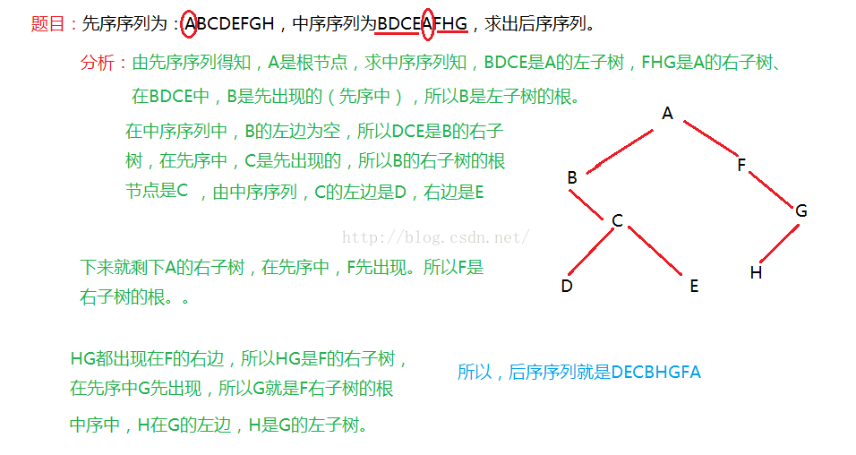
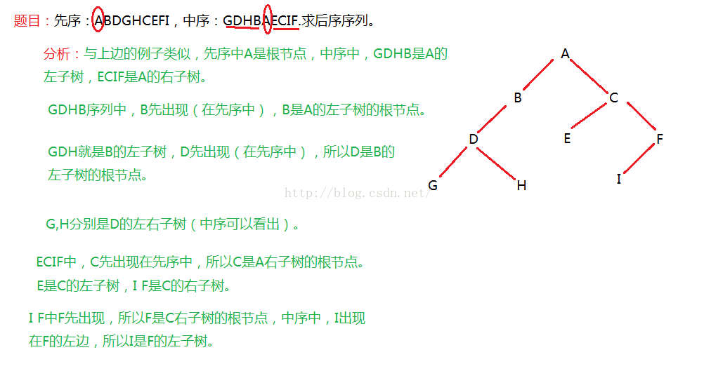
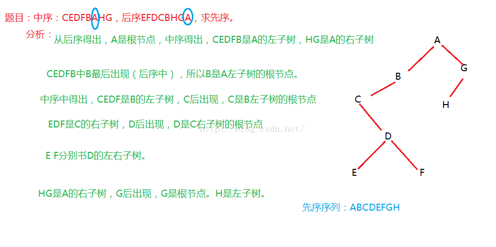

#二叉树
[toc]

参考：
* [面试题](http://blog.csdn.net/luckyxiaoqiang/article/details/7518888/)
* [各种树的基础知识](http://blog.csdn.net/yi_zz/article/details/7401112)
* 参考(http://blog.csdn.net/peiyao456/article/category/6265978)

##BinaryTree (二叉树)
* ###定义

    二叉树是有限个元素的集合，该集合或者为空、或者有一个称为根节点（root）的元素及两个互不相交的、分别被称为左子树和右子树的二叉树组成。
* ###性质

    1. 二叉树的每个结点至多只有二棵子树(不存在度大于2的结点)，二叉树的子树有左右之分，次序不能颠倒。
    2. 二叉树的第i层至多有 **2^{i-1}** 个结点    
    3. 深度为k的二叉树至多有2^k-1个结点；
    4. 对任何一棵二叉树T，如果其终端结点数为N0，度为2的结点数为N2，则N0=N2+1
    
###实现：
```
class Node(object):
    """节点类"""
    def __init__(self, elem=-1, lchild=None, rchild=None):
        self.elem = elem
        self.lchild = lchild
        self.rchild = rchild
     
class Tree(object):
    """树类"""
    def __init__(self):
        self.root = Node()


    def add(self, elem):
        """为树添加节点"""
        node = Node(elem)
        if self.root.elem == -1: #如果树是空的，则对根节点赋值
            self.root = node
        else:                     
            myQueue = []
            treeNode = self.root
            myQueue.append(treeNode)
            while myQueue:  #对已有的节点进行层次遍历
                treeNode = myQueue.pop(0)
                if treeNode.lchild == None:
                    treeNode.lchild = node
                    return
                elif treeNode.rchild == None:
                    treeNode.rchild = node
                    return
                else:
                    myQueue.append(treeNode.lchild)
                    myQueue.append(treeNode.rchild)


    def front_digui(self, root):
        """利用递归实现树的先序遍历"""
        if root == None:
            return
        print root.elem,
        self.front_digui(root.lchild)
        self.front_digui(root.rchild)


    def middle_digui(self, root):
        """利用递归实现树的中序遍历"""
        if root == None:
            return
        self.middle_digui(root.lchild)
        print root.elem,
        self.middle_digui(root.rchild)


    def later_digui(self, root):
        """利用递归实现树的后序遍历"""
        if root == None:
            return
        self.later_digui(root.lchild)
        self.later_digui(root.rchild)
        print root.elem,


    def front_stack(self, root):
        """利用堆栈实现树的先序遍历"""
        if root == None:
            return
        myStack = []
        node = root
        while node or myStack:
            while node:  #从根节点开始，一直找它的左子树
                print node.elem,
                myStack.append(node)
                node = node.lchild
            #while结束表示当前节点node为空，即前一个节点没有左子树了
            node = myStack.pop()  
            node = node.rchild    #开始查看它的右子树


    def middle_stack(self, root):
        """利用堆栈实现树的中序遍历"""
        if root == None:
            return
        myStack = []
        node = root
        while node or myStack:
            while node:    #从根节点开始，一直找它的左子树
                myStack.append(node)
                node = node.lchild
            node = myStack.pop()  #while结束表示当前节点node为空，即前一个节点没有左子树了
            print node.elem,
            node = node.rchild   #开始查看它的右子树


    def later_stack(self, root):
        """利用堆栈实现树的后序遍历"""
        if root == None:
            return
        myStack1 = []
        myStack2 = []
        node = root
        myStack1.append(node)
        while myStack1:                   #这个while循环的功能是找出后序遍历的逆序，存在myStack2里面
            node = myStack1.pop()
            if node.lchild:
                myStack1.append(node.lchild)
            if node.rchild:
                myStack1.append(node.rchild)
            myStack2.append(node)
        while myStack2:                         #将myStack2中的元素出栈，即为后序遍历次序
            print myStack2.pop().elem,


    def level_queue(self, root):
        """利用队列实现树的层次遍历"""
        if root == None:
            return
        myQueue = []
        node = root
        myQueue.append(node)
        while myQueue:
            node = myQueue.pop(0)
            print node.elem,
            if node.lchild != None:
                myQueue.append(node.lchild)
            if node.rchild != None:
                myQueue.append(node.rchild)


if __name__ == '__main__':
    """主函数"""
    elems = range(10)           #生成十个数据作为树节点
    tree = Tree()          #新建一个树对象
    for elem in elems:                  
        tree.add(elem)           #逐个添加树的节点

    print '队列实现层次遍历:'
    tree.level_queue(tree.root)

    print '\n\n递归实现先序遍历:'
    tree.front_digui(tree.root)
    print '\n递归实现中序遍历:' 
    tree.middle_digui(tree.root)
    print '\n递归实现后序遍历:'
    tree.later_digui(tree.root)

    print '\n\n堆栈实现先序遍历:'
    tree.front_stack(tree.root)
    print '\n堆栈实现中序遍历:'
    tree.middle_stack(tree.root)
    print '\n堆栈实现后序遍历:'
    tree.later_stack(tree.root)
```

###遍历顺序方法
一、已知先序和中序，求出后序。


下边再举一个例子，如下图：


通过上边两个例子的学习，对这种题目有了一定的理解，下边举例已知中序和后序，求先序。
二、已知中序和后序，求先序。

###最大连续子数和
```
def maxsum(arr):
'''
时间为O(n)
'''
	sum,ans= None,None
	for i in arr:
		sum+=i
		if sum > ans: ans=sum
		#当sum小于零 则代表新增加的数副作用之前的数，之后重新进行计算，同时比较该数之前的和
		if sum < 0: sum=0
		
```

